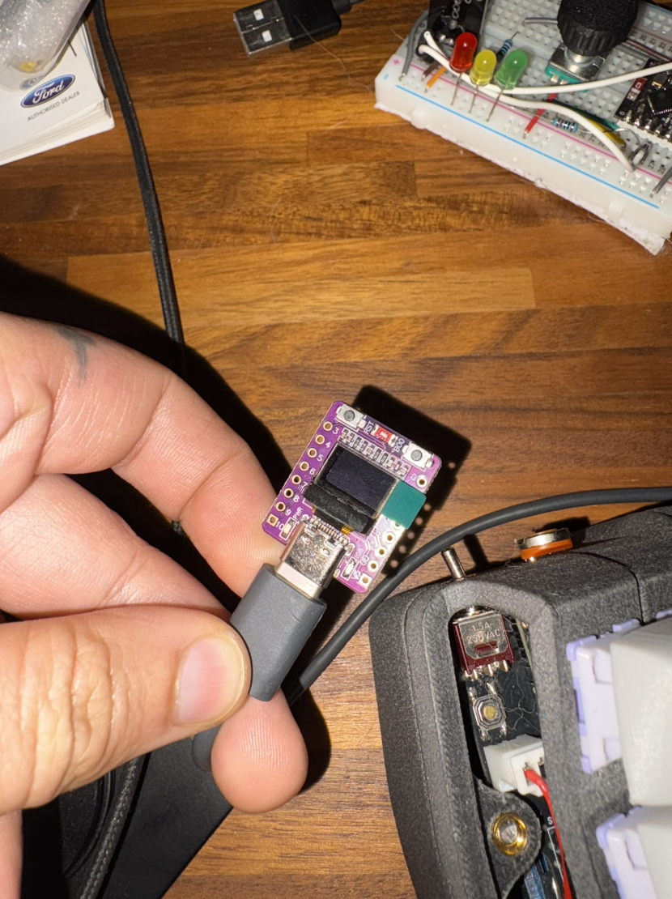

## MicroPython Pill Timer
Built for myself, an individual so forgetful that he often forgets to take his medication, as well as whether he took it in the first place. 

I'm a full stack web dev, and this is my first ever MicroPython project - so keep your expectations fairly low.

### Introduction
I've dabbled with Arduino but never MicroPython. 

This is what I found out:

|  | Arduino | MicroPython |
|--------|---------|-------------|
| **Language** | C/C++ | Python |
| **Speed** | Fast | Slow |
| **Memory Usage** | Minimal | RAM hungry |

So it sucks, right? Kinda!

Do you know what else sucks? (from experience)
* Learning C/C++ 
* Debugging in Arduino
* Developing on a compiled language

MicroPython makes a tempting promise: build cool things without learning C/C++, see error messages in the shell WITHOUT 100s of print statements, and iterate quickly without the repeated compilation step. 


### How it works for noobs
When writing an Arduino sketch, your cursed C/C++ code is compiled and uploaded.

In MicroPython, your Python code runs on a Python interpreter that's already living on the microcontroller. 

### How to get started
This assumes you're using an ESP32 (since that's the only reasonable option)

**Setting up MicroPython**
1. [Download the latest MicroPython binary](https://micropython.org/download/ESP32_GENERIC_C3/) 
2. Run: `brew install minicom esptool`
3. `cd` to wheverever it's downloaded to
4. Hold down 'boot' and plug it in, then run: `ls /dev/tty.usbmodem*` to find the port (mine was /dev/tty.usbmodem3231301)
5. Erase the old image with: `esptool.py --chip esp32c3 --port [port from before] erase_flash`
6. Then flash the downloaded binary `esptool.py --chip esp32c3 --port [port from before] --baud 460800 write_flash -z 0x0 ESP32_GENERIC_C3-20250809-v1.26.0.bin`
7. Test with Minicom: `minicom -D [port from before] -b 115200` and just run some python `print("hello world")`

**Project setup**
1. Clone this repo and create a virtualenv
   - `python3 -m venv .venv && source .venv/bin/activate`
   - `pip install -r requirements.txt`
2. Copy `secrets.example.py` to `secrets.py` and fill in your Wifi and Supabase details
3. Optionally tweak `settings.json` for your schedule and timezone offset (minutes)

**Deploy to ESP32-C3**
- Fast path: `make deploy` (uses first `/dev/tty.usbmodem*`)
- Or manually: `mpremote cp main.py : && mpremote cp ssd1306.py : && mpremote cp settings.json : && mpremote cp secrets.py : && mpremote reset`

**Adding the OLED driver**
1. `ssd1306.py` is included in this repo.
2. Copy it to the device: `mpremote cp ssd1306.py :`


#### Troubleshooting
**Issues with mpremote**
Run `mpremote connect [port from before]` to make sure its actually connected

**Secrets safety**
- This repo ignores `secrets.py`. Do not commit real keys. Share only `secrets.example.py`.


### Hardware
ESP32-C3 with 0.42" OLED



https://www.aliexpress.com/item/1005009045080441.html

This bad boy has Wifi and 4MB of RAM


#### This project is still in development

### Database (Supabase) quick setup
This project uses my own database. To run it yourself, create minimal tables and policies in your Supabase project.
I chose Supabase because it sets up a REST API automatically for every table via PostgREST.

1) Create tables (paste in SQL Editor)
```sql
-- Pills submitted by the device
create table if not exists public.stimulants (
  id bigint generated always as identity primary key,
  created_at timestamptz not null default now(),
  qty integer not null,
  drug text not null,
  dose integer not null,
  dose_unit text not null
);

-- A simple status feed the device reads
create table if not exists public.daily_log (
  id bigint generated always as identity primary key,
  created_at timestamptz not null default now(),
  event_type text not null
);

-- Enable RLS
alter table public.stimulants enable row level security;
alter table public.daily_log enable row level security;

-- Minimal policies for anon key (demo/dev). Adjust for production.
drop policy if exists "anon read stimulants" on public.stimulants;
create policy "anon read stimulants" on public.stimulants
  for select to anon using (true);

drop policy if exists "anon insert stimulants" on public.stimulants;
create policy "anon insert stimulants" on public.stimulants
  for insert to anon with check (true);

drop policy if exists "anon read daily_log" on public.daily_log;
create policy "anon read daily_log" on public.daily_log
  for select to anon using (true);
```

2) Get your credentials
- Supabase URL: Project Settings → API → Project URL
- Anon key: Project Settings → API → anon key

3) Put them in `secrets.py`
```python
SUPABASE_URL = "https://<your-project>.supabase.co"
SUPABASE_KEY = "<anon-key>"
WIFI_SSID = "<your-ssid>"
WIFI_PASSWORD = "<your-wifi-password>"
```

Note: The policies above allow anonymous inserts/selects for quick start. For production, restrict by auth or move writes behind an authenticated edge function.
### License
MIT, see `LICENSE`.
